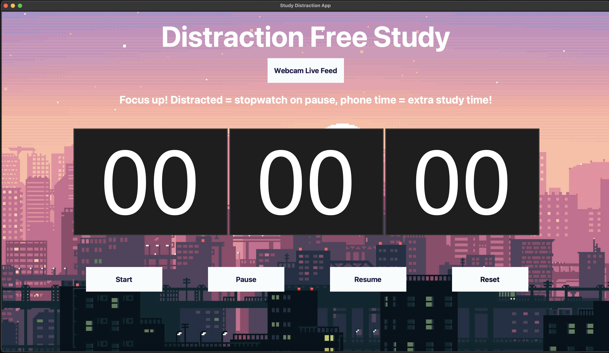

# Distraction Free Study App

## Project Description

**Motivation**

This is a small side project that was developed while working through the Machine Learning A-Z course on Udemy, as a way to apply some of the skills I learned.

**What the application does**

A simple study timer app, that uses AI and machine learning to detect if the user is distracted/not present/on their phone. Simple distractions lead to the timer being paused, and if the user is detected using their phone, a penalty is enforced and 10 seconds extra study time is added for every second on the phone.

**The AI Model**

To find if the user is focused (working on their computer screen/reading/writing) or distracted (looking away/not present) a random forest classification was used. The dataset used was created by myself with approximately 35, 20 second clips of myself, split into frames and labelled. From this Media Pipe was used to extract facial landmarks and then perform calculations to create the feature list for the model. After training the model had an accuracy score of around 0.99. Phone detection is based on yolov8, hence not trained myself.

  
  

**Limitations**

The model is trained on a dataset based on myself, hence may not generalize well to others without further training. Furthermore this is a very basic structured app with sometimes flawed detection and limited features for the user, which could be implemented further on.

## How to run the application

**Install required libraries**

<pre> pip install -r requirements.txt </pre>

**Navigate to correct folder and run**

<pre> cd src </pre>

<pre> python3 main.py </pre>

